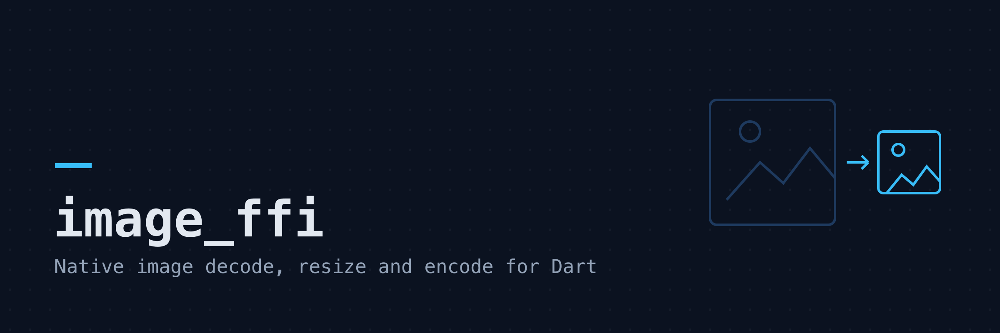
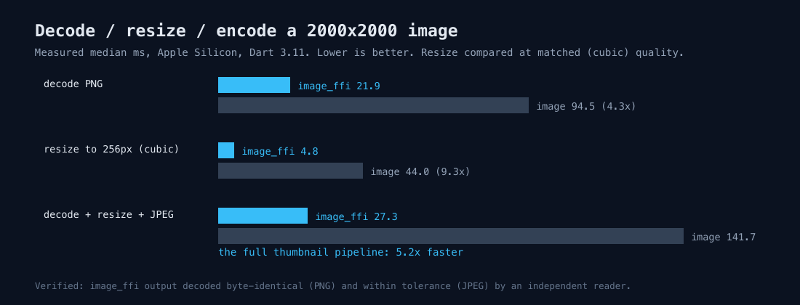
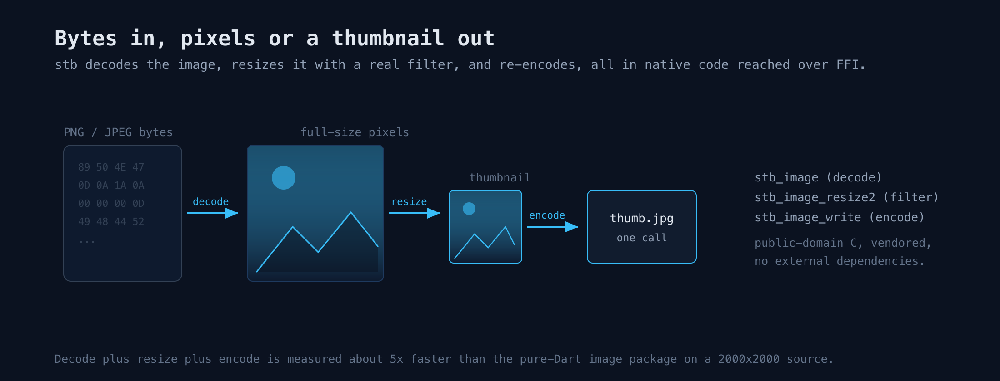

# image_ffi



Native image decode, resize and encode for Dart, backed by Sean Barrett's
[stb](https://github.com/nothings/stb) single-file C libraries over FFI. The stb
sources are compiled from source by a Dart build hook, so there is no prebuilt
binary to ship and nothing to install beyond a C toolchain.

The pure-Dart [`image`](https://pub.dev/packages/image) package is the right
choice when you need its wide manipulation and filter suite. `image_ffi` is
narrower on purpose: it does decode, high-quality resize, JPEG/PNG encode and
one-call thumbnails, and it runs those in native code. If your workload is
"read an image, make a thumbnail, write it back", this is several times faster.
For cropping, drawing, filters, format conversions and animation, use `image`.

## Formats

- Decode: PNG, JPEG, BMP, GIF, PSD, TGA, HDR, PIC (whatever stb_image reads).
- Encode: JPEG and PNG.

## Install

```yaml
dependencies:
  image_ffi: ^0.1.0
```

Building the native library needs a C toolchain and Dart's native build hooks
enabled (see [Platforms](#platforms)).

## Quick start

```dart
import 'dart:io';
import 'package:image_ffi/image_ffi.dart';

void main() {
  final bytes = File('photo.jpg').readAsBytesSync();

  // Dimensions without decoding the pixels.
  final info = imageInfo(bytes);
  print('${info.width}x${info.height}, ${info.channels} channels');

  // Decode to raw pixels (native channel count, or force one).
  final image = decodeImage(bytes, forceChannels: 4);

  // High-quality, sRGB-correct resize.
  final small = resizePixels(
    image.pixels,
    srcWidth: image.width,
    srcHeight: image.height,
    dstWidth: image.width ~/ 2,
    dstHeight: image.height ~/ 2,
    channels: image.channels,
  );

  // Encode back to JPEG or PNG.
  File('half.jpg').writeAsBytesSync(
    encodeJpeg(small, width: image.width ~/ 2, height: image.height ~/ 2,
        channels: 4, quality: 90),
  );

  // Or do decode, downscale and encode in one call.
  File('thumb.jpg').writeAsBytesSync(thumbnailJpeg(bytes, maxDimension: 256));
}
```

Decode and encode copy the native bytes into a Dart `Uint8List` and free the
native buffer before returning, so you never manage native memory. Invalid
input throws `ImageFfiException` with stb's own failure reason; bad arguments
throw `ArgumentError`.

## Benchmark

Decode a 2000x2000 PNG and downscale it to a 256px thumbnail, `image_ffi`
against the pure-Dart `image` package doing the same work. Medians of 15 runs on
an Apple M-series laptop:



| Operation                     | image_ffi | image    | Speedup |
| ----------------------------- | --------- | -------- | ------- |
| decode PNG                    | 21.9 ms   | 94.5 ms  | 4.3x    |
| resize to 256px               | 4.8 ms    | 44.0 ms  | 9.3x    |
| decode + resize + JPEG encode | 27.3 ms   | 141.7 ms | 5.2x    |

The resize row uses cubic interpolation for the `image` package so both sides do
a comparable high-quality filter. The `image` package's default nearest-neighbor
resize is faster than either (about 0.4 ms here) but much lower quality, so it is
not a like-for-like comparison. Numbers are machine-dependent; reproduce them
with `dart run bench/bench.dart`.

## API

- `decodeImage(bytes, {forceChannels})` returns a `DecodedImage` with `width`,
  `height`, `channels` and row-major `pixels`.
- `imageInfo(bytes)` returns `(width, height, channels)` from the header only.
- `resizePixels(pixels, {srcWidth, srcHeight, dstWidth, dstHeight, channels,
  colorSpace})`. `colorSpace` is `ResizeColorSpace.srgb` by default (right for
  photographic and UI images) or `.linear` for masks and data pixels. Two-channel
  input is resampled as grayscale + alpha, four-channel as non-premultiplied
  RGBA, so edges against transparency stay clean.
- `encodeJpeg(pixels, {width, height, channels, quality})` and
  `encodePng(pixels, {width, height, channels})`.
- `thumbnailJpeg(bytes, {maxDimension, quality})` decodes, downscales so the
  longer side is at most `maxDimension` (never enlarging), and JPEG-encodes.

## How it works



## Platforms

The native library is compiled from the vendored stb sources by
`hook/build.dart` using Dart's native build hooks. It works anywhere Dart runs a
C compiler for the target: Linux, macOS and Windows on the Dart CLI and server.
Requires Dart 3.9 or later. Flutter support follows once native build hooks are
stable for Flutter builds.

The CI matrix builds and tests on Ubuntu, macOS and Windows.

## Credits

The image codecs and resampler are Sean Barrett's
[stb](https://github.com/nothings/stb) libraries (`stb_image`,
`stb_image_write`, `stb_image_resize2`), released into the public domain. Their
vendored copies live in `src/third_party/stb`. See `LICENSE` for details.
