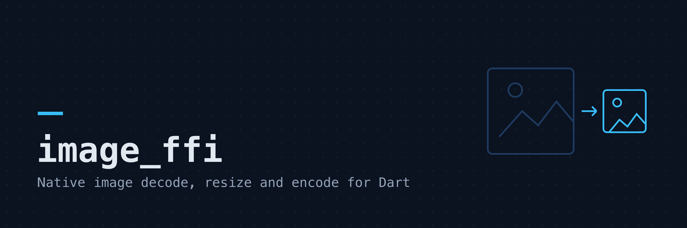
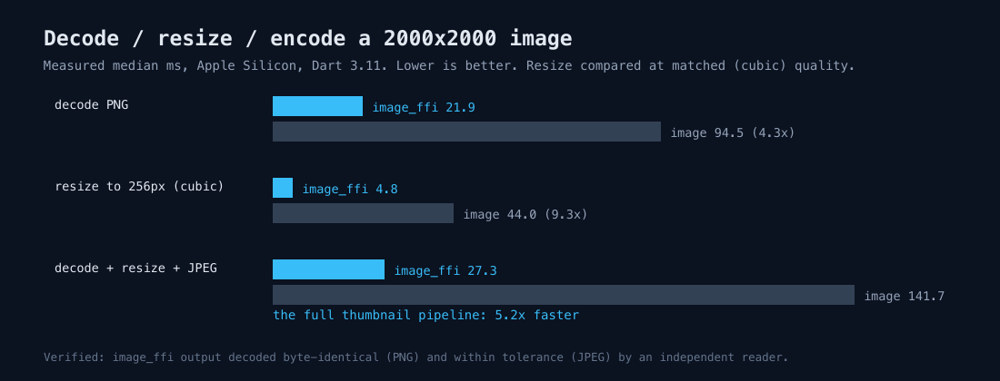
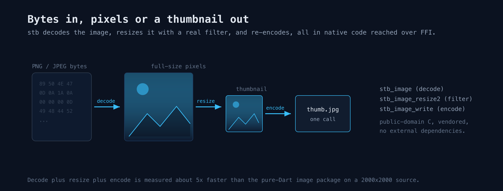

# image_ffi



Native image decode, resize and encode for Dart, backed by Sean Barrett's
[stb](https://github.com/nothings/stb) single-file C libraries over FFI. A Dart
build hook compiles the stb sources at build time: there is no prebuilt binary
to ship and nothing to install beyond a C toolchain.

The pure-Dart [`image`](https://pub.dev/packages/image) package is the right
choice when you need its wide manipulation and filter suite. `image_ffi` is
narrower on purpose: it does decode, high-quality resize, JPEG/PNG encode and
one-call thumbnails, and it runs those in native code. If your workload is
"read an image, make a thumbnail, write it back", this is several times faster.
For cropping, drawing, filters, format conversions and animation, use `image`.

## Formats

- Decode: PNG, JPEG, BMP, GIF, PSD, TGA, HDR, PIC (whatever stb_image reads).
- Encode: JPEG and PNG.

## Install

```sh
dart pub add image_ffi
```

Building the native library needs a C toolchain and Dart's native build hooks
enabled (see [Platforms](#platforms)).

## Quick start

```dart
import 'dart:io';
import 'package:image_ffi/image_ffi.dart';

void main() {
  final bytes = File('photo.jpg').readAsBytesSync();

  // Dimensions without decoding the pixels.
  final info = imageInfo(bytes);
  print('${info.width}x${info.height}, ${info.channels} channels');

  // Decode to raw pixels (native channel count, or force one).
  final image = decodeImage(bytes, forceChannels: 4);

  // High-quality, sRGB-correct resize.
  final small = resizePixels(
    image.pixels,
    srcWidth: image.width,
    srcHeight: image.height,
    dstWidth: image.width ~/ 2,
    dstHeight: image.height ~/ 2,
    channels: image.channels,
  );

  // Encode back to JPEG or PNG.
  File('half.jpg').writeAsBytesSync(
    encodeJpeg(small, width: image.width ~/ 2, height: image.height ~/ 2,
        channels: 4, quality: 90),
  );

  // Or do decode, downscale and encode in one call.
  File('thumb.jpg').writeAsBytesSync(thumbnailJpeg(bytes, maxDimension: 256));
}
```

Decode and encode copy the native bytes into a Dart `Uint8List` and free the
native buffer before returning. You never manage native memory. Invalid input
throws `ImageFfiException` with stb's own failure reason; bad arguments throw
`ArgumentError`.

## Phone photos come out upright

Hold a phone in portrait and the sensor still records a landscape buffer. What
makes the photo upright is a number in the EXIF header saying how to turn it.
Viewers read that number. Code that decodes pixels does not, which is how a
thumbnailer produces sideways thumbnails and reports no error at all.

`thumbnailJpeg` and `thumbnailPng` read the tag and apply it. Nothing to pass:

```dart
final thumb = thumbnailJpeg(photoBytes, maxDimension: 128);
```

`example/upright_thumbnails.dart` takes a 400x300 sensor buffer tagged
orientation 6 and prints what each path returns:

```
EXIF orientation tag       6  (6: turn 90 CW)
decodeImage                400x300    the sensor buffer
thumbnailJpeg              96x128     upright, nothing asked for
  ...applyOrientation off  128x96     the sideways version
applyExifOrientation       300x400    same result, by hand
```

Pass `applyOrientation: false` when you want the sensor framing, and reach for
`exifOrientation` and `applyExifOrientation` when you decode and resize
yourself:

```dart
final image = decodeImage(photoBytes);
final upright = applyExifOrientation(image, exifOrientation(photoBytes));
```

`exifOrientation` returns 1 for a file with no EXIF, a value out of range, or a
malformed tag, so a bad header costs you a rotation rather than a decode.

## Benchmark

Decode a 2000x2000 PNG and downscale it to a 256px thumbnail, `image_ffi`
against the pure-Dart `image` package doing the same work. Medians of 15 runs on
an Apple M-series laptop:



| Operation                     | image_ffi | image    | Speedup |
| ----------------------------- | --------- | -------- | ------- |
| decode PNG                    | 21.9 ms   | 94.5 ms  | 4.3x    |
| resize to 256px               | 4.8 ms    | 44.0 ms  | 9.3x    |
| decode + resize + JPEG encode | 27.3 ms   | 141.7 ms | 5.2x    |

The resize row uses cubic interpolation for the `image` package so both sides do
a comparable high-quality filter. The `image` package's default nearest-neighbor
resize is faster than either (about 0.4 ms here) at much lower quality;
measuring against that would not be like-for-like. Numbers are
machine-dependent; reproduce them with `dart run bench/bench.dart`.

## API

- `decodeImage(bytes, {forceChannels})` returns a `DecodedImage` with `width`,
  `height`, `channels` and row-major `pixels`.
- `imageInfo(bytes)` returns `(width, height, channels)` from the header only.
- `resizePixels(pixels, {srcWidth, srcHeight, dstWidth, dstHeight, channels,
  colorSpace})`. `colorSpace` is `ResizeColorSpace.srgb` by default (right for
  photographic and UI images) or `.linear` for masks and data pixels. Two-channel
  input is resampled as grayscale + alpha, four-channel as non-premultiplied
  RGBA, so edges against transparency stay clean.
- `encodeJpeg(pixels, {width, height, channels, quality})` and
  `encodePng(pixels, {width, height, channels})`.
- `exifOrientation(bytes)` reads a JPEG's orientation tag, returning 1 to 8, and
  1 for anything it cannot read. `applyExifOrientation(image, orientation)`
  returns the upright version of a `DecodedImage`.
- `thumbnailJpeg(bytes, {maxDimension, quality, applyOrientation})` decodes,
  downscales so the longer side is at most `maxDimension` (never enlarging), and
  JPEG-encodes. `applyOrientation` defaults to true, which is what keeps phone
  photos upright; see above. `thumbnailPng(bytes, {maxDimension,
  applyOrientation})` does the same but PNG-encodes, keeping the alpha channel a
  JPEG would drop.
- `thumbnailJpegAsync` and `thumbnailPngAsync` take the same arguments and
  return a `Future`; see below.
- `thumbnailJpegBatch(images, {maxDimension, quality, concurrency})` and
  `thumbnailPngBatch(images, {maxDimension, concurrency})` thumbnail a whole
  folder off the main isolate while capping how many isolates run at once; see
  below.

## Off the main isolate

`thumbnailJpegAsync` and `thumbnailPngAsync` run the whole decode, resize and
encode on a background isolate with `Isolate.run`, so a large image doesn't
block the isolate that called them:

```dart
final thumb = await thumbnailJpegAsync(bytes, maxDimension: 256);
```

This is the reason to reach for a native writer in a Flutter app: the pure-Dart
`image` package runs on the calling isolate and janks the UI while a big photo
is processed, and a plain synchronous FFI call does the same. The async variants
keep the UI isolate free. The input bytes are copied to the worker and the
result copied back; for a handful of images that copy is small next to the
decode. An `ImageFfiException` raised in the worker surfaces from the future.

## A folder of images

Over a whole directory, do not reach for `Future.wait` on the async variants:

```dart
// Don't. This spawns one isolate per image at once, each holding a full
// decoded buffer, so a real folder can run the process out of memory.
final thumbs = await Future.wait(images.map(thumbnailJpegAsync));
```

Use `thumbnailJpegBatch` (or `thumbnailPngBatch`) instead. It runs the same
per-image work off the main isolate but caps how many isolates are live at
once, to `concurrency`, which defaults to `Platform.numberOfProcessors`:

```dart
await for (final thumb in thumbnailJpegBatch(images, concurrency: 4)) {
  // write thumb
}
```

`maxDimension` and `quality` mean what they do on `thumbnailJpeg`. Each
thumbnail is emitted as it finishes. Results arrive in completion order rather
than the order of `images`; pair a result with its source before the call if
you need the correspondence. A failure on one image surfaces as an error on the
stream while the rest keep going.

## How it works



## Shipping a standalone binary

`dart compile exe` does not run build hooks, so a program that depends on this
package stops before it starts:

```
$ dart compile exe bin/my_cli.dart
'dart compile' does not support build hooks, use 'dart build' instead.
```

`dart build cli` runs the hook and lays the pieces out for you:

```
$ dart build cli
Generated: build/cli/<os>_<arch>/bundle/bin/my_cli
$ ls build/cli/macos_arm64/bundle/*
bin/  my_cli
lib/  libimage_ffi_shim.dylib
```

Ship the whole `bundle/` directory. The executable resolves its library through
a relative `../lib` path, so a copy of the binary on its own fails at the first
call:

```
Failed to load dynamic library '../lib/libimage_ffi_shim.dylib'
```

`dart build cli` takes no positional target. With one file under `bin/` the bare
command is enough; with more than one, pass `-t`. `dart run` and `dart test` are
unaffected, since both run the hook already. The command is marked preview in
Dart 3.11.

## Platforms

The native library is compiled from the vendored stb sources by
`hook/build.dart` using Dart's native build hooks. It works anywhere Dart runs a
C compiler for the target: Linux, macOS and Windows on the Dart CLI and server,
and in Flutter apps whose build has native assets enabled, where the same hook
runs and the async variants keep image work off the UI isolate. Requires Dart
3.10 or later.

The CI matrix builds and tests on Ubuntu, macOS and Windows.

Mobile and desktop Flutter are checked by running a decode inside the app
rather than by building it, because a green build says nothing about whether
the library loads. A Flutter app that encodes and decodes a small PNG at
startup and prints the result returns `2x2` on an iPhone 17 Pro simulator
running iOS 26.5, on an Android 15 arm64 emulator (API 35), and on macOS
desktop.

## Credits

The image codecs and resampler are Sean Barrett's
[stb](https://github.com/nothings/stb) libraries (`stb_image`,
`stb_image_write`, `stb_image_resize2`), released into the public domain. Their
vendored copies live in `src/third_party/stb`. See `LICENSE` for details.
